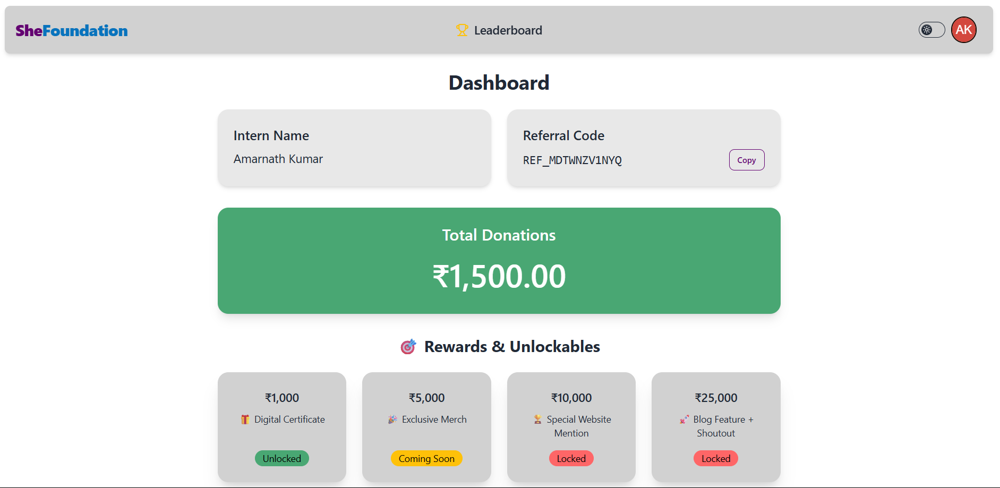
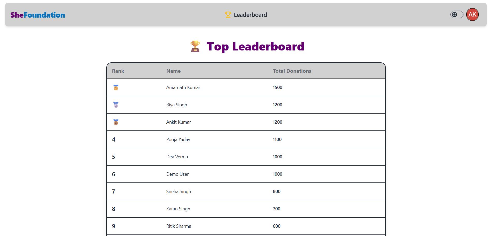
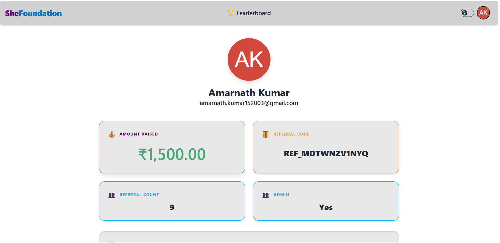

# 🚀 She Foundation Dashboard

A modern full-stack dashboard for She Foundation, tracking donations, rewards/unlockables, and leaderboard rankings.

## ✨ Features

- 🪪 **Authentication:** Dummy login \& signup forms (JWT-based)
- 🏠 **Dashboard:** View intern name, referral code, total donations raised, and dynamic rewards/unlockables
- 🏆 **Leaderboard:** See top interns sorted by donation amount
- 🌗 **Dark/Light Mode:** One-click theme toggle
- 🖥️ **Profile Page:** View personal details, admin status, referral count, and bio
- 🚦 **Protected Routing:** Only authenticated users can access dashboard/leaderboard/profile
- 🍪 **Session Handling:** Secure login via cookies (with JWT)
- ⚡ **Live API Integration:** Data fetched in real time via MongoDB backend

## 📸 Screenshots

|          Dashboard          |          Leaderboard          |          Profile          |
| :-------------------------: | :---------------------------: | :-----------------------: |
|  |  |  |

## 🏗️ Tech Stack

- **Frontend:** React, Zustand, Tailwind CSS, DaisyUI, React Hot Toast, React Router
- **Backend:** Node.js, Express, MongoDB (Mongoose), JWT Auth

## 🚦 Running Locally

### 1. Clone this repository

```bash
git clone https://github.com/Amarsah15/She-Foundation.git
cd she-foundation
```

### 2. Backend Setup

```bash
cd backend
npm install
```

- Create a `.env` file with your MongoDB URI and JWT secret:

```
PORT=8000
MONGO_URI=your_mongodb_uri
JWT_SECRET=your_jwt_secret
NODE_ENV=development
```

- Start the backend:

```bash
npm run dev
```

### 3. Frontend Setup

```bash
cd ../frontend
npm install
npm run dev
```

- The frontend should open [http://localhost:5173](http://localhost:5173).

## 🔑 Dummy Test Credentials

- You can sign up with any dummy info on the signup page! No email verification is required.

## 🎁 Rewards/Unlockables

- Rewards badges and unlocks update immediately based on your total donations.
  - _Unlocked_ if you've reached the target amount
  - _Coming Soon_ indicates the next reward you're closest to
  - _Locked_ for those still farther away

## 📦 Folder Structure

```
/
│
├── backend/
│   ├── controllers/
│   ├── middlewares/
│   ├── models/
│   ├── routes/
│   ├── config/
│   └── ...
│
├── frontend/
│   ├── src/
│       ├── components/
│       ├── pages/
│       ├── stores/
│       └── ...
│   ├── public/
│   └── ...
│
└── README.md
```

## 🙌 Acknowledgements

- Built with ❤️ by Amarnath Kumar
